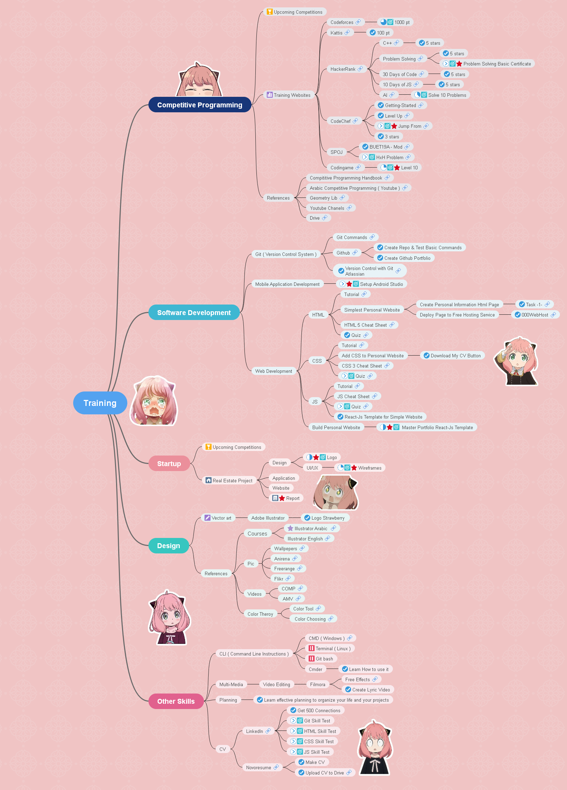

<h1 align="center"> My Training Mind Map 🔥 </h1> 

<h3 align="center" >Attention ⚠</h3>
<h4 align="center">
On August 29, 2022 🗓 , we decided to stop sharing training details for privacy reasons 🔒.
</h4>

#
<h3 align="center">
We hope everyone who watches this repo check it out 🎉 and give it a star ⭐ if they feel it is useful 🤍.
</h3>

#
<h3 align="center">Coach Report 📄</h3>
<h4 align="center">
Noor is a great and passionate person who has a lot of abilities and talents 🚀 for her current age (less than 16 years old). She is very distinguished and can compete with university students in programming and related skills 🔥.
</h4> 
<h4 align="center">
I'm so glad I was her coach and I'll make sure she reaches her goal 🎈 of becoming a great programmer ✨.
</h4>
<h4 align="right">🖊 By Coach Muhammad Hassoud</h4>

#
<h3 align="center">Training Mind Map 🎯</h3>

 Made with :blue_heart: by <a href="https://github.com/nourgassan07">Noor Gassan 07</a>

